# 상품 유형 설정 기능

> **작성일**: 2025-10-05  
> **버전**: v1.0.0

---

## 🎯 개요

조직마다 필요한 상품 유형이 다르므로, **설정 메뉴에서 사용할 유형을 선택**할 수 있는 기능입니다.

### 주요 특징

- ✅ **LocalStorage 기반**: 브라우저 로컬 저장소에 설정 저장
- ✅ **실시간 필터링**: 상품 등록 시 활성화된 유형만 표시
- ✅ **직관적인 UI**: 체크박스 기반 선택/해제
- ✅ **다국어 지원**: 한국어, 영어, 중국어
- ✅ **안전장치**: 최소 1개 유형 필수 선택

---

## 📍 접근 경로

### 1) 사이드바 메뉴

```
대시보드
├─ 상품 관리
├─ 입고 관리
├─ 출고 관리
├─ 조회 (재고)
│
└─ ⚙️ 설정 (NEW!)
   └─ 상품 유형 설정
```

### 2) URL

```
http://139.59.110.55/settings/item-types
```

---

## 🖥️ 화면 구성

### 설정 페이지

```
┌──────────────────────────────────────────────────────┐
│ ⚙️ 상품 유형 설정                                   │
│ ──────────────────────────────────────────────────── │
│ 사용할 상품 유형을 선택하세요                         │
│                                           [전체 선택] [전체 해제] │
│                                                       │
│ ┌────────────────────────────────────────────────┐  │
│ │ 활성화된 유형                                   │  │
│ ├────────────────────────────────────────────────┤  │
│ │ 제조 계층                                       │  │
│ │                                                 │  │
│ │ ☑ 완제품 (Finished Goods)                      │  │
│ │   최종 판매 제품 (BOM 구성 가능, 판매 가능)     │  │
│ │                                                 │  │
│ │ ☑ 반제품 (Semi-Finished)                       │  │
│ │   중간 조립 제품 (BOM 구성 가능)                │  │
│ │                                                 │  │
│ │ ☑ 모듈 (Module)                                │  │
│ │   여러 부품이 조립된 서브어셈블리 (BOM 구성 가능)│  │
│ │                                                 │  │
│ │ ☐ 부품 (Part)                                  │  │
│ │   단일 구성품, 더 이상 분해 불가 (BOM 없음)     │  │
│ │                                                 │  │
│ │ ☑ 원자재 (Raw Material)                        │  │
│ │   가공 전 원자재 (구매만 가능)                  │  │
│ │                                                 │  │
│ │ ──────────────────────────────────────────────│  │
│ │ 기타                                            │  │
│ │                                                 │  │
│ │ ☐ 상품 (Merchandise)                           │  │
│ │   구매 후 재판매 상품 (BOM 없음)                │  │
│ │                                                 │  │
│ │ ☐ 소모품 (Consumable)                          │  │
│ │   생산/운영 소모품                              │  │
│ │                                                 │  │
│ │ ☐ 포장재 (Packaging)                           │  │
│ │   포장용 자재                                    │  │
│ │                                                 │  │
│ │                                [설정 저장]       │  │
│ └────────────────────────────────────────────────┘  │
│                                                       │
│ ┌────────────────────────────────────────────────┐  │
│ │ 미리보기                                        │  │
│ ├────────────────────────────────────────────────┤  │
│ │ [완제품] [반제품] [모듈] [원자재]               │  │
│ └────────────────────────────────────────────────┘  │
└──────────────────────────────────────────────────────┘
```

---

## 🔄 작동 방식

### 1️⃣ 설정 저장 (LocalStorage)

```typescript
// 저장 구조
localStorage.setItem('enabled_item_types', JSON.stringify(['FG', 'SF', 'MOD', 'RM']))

// 저장 위치
// 브라우저 LocalStorage
// Key: enabled_item_types
// Value: ["FG", "SF", "MOD", "RM"]
```

### 2️⃣ 상품 등록 페이지 필터링

**설정 전 (전체 유형 표시)**:

```
상품 유형:
  제조 계층
  ├─ 완제품 (FG)
  ├─ 반제품 (SF)
  ├─ 모듈 (MOD)
  ├─ 부품 (PT)
  └─ 원자재 (RM)

  기타
  ├─ 상품 (MR)
  ├─ 소모품 (CS)
  └─ 포장재 (PKG)
```

**설정 후 (활성화된 유형만)**:

```
상품 유형:
  제조 계층
  ├─ 완제품 (FG)      ✅
  ├─ 반제품 (SF)      ✅
  ├─ 모듈 (MOD)       ✅
  └─ 원자재 (RM)      ✅

  (기타 섹션 숨김)
```

### 3️⃣ 데이터 흐름

```mermaid
graph LR
    A[설정 페이지] -->|저장| B[LocalStorage]
    B -->|로드| C[useItemTypeSettings]
    C -->|필터링| D[상품 등록 페이지]
    D -->|선택 가능한 유형만 표시| E[사용자]
```



---

## 🛠️ 기술 구현

### 1) 커스텀 훅: useItemTypeSettings

```typescript
// src/shared/hooks/useItemTypeSettings.ts

export function useItemTypeSettings() {
  const [enabledTypes, setEnabledTypes] = useState<string[]>(DEFAULT_ENABLED_TYPES)
  const [isLoading, setIsLoading] = useState(true)

  useEffect(() => {
    // LocalStorage에서 로드
    const stored = localStorage.getItem('enabled_item_types')
    if (stored) {
      setEnabledTypes(JSON.parse(stored))
    }
  }, [])

  const isTypeEnabled = (typeCode: string): boolean => {
    return enabledTypes.includes(typeCode)
  }

  const filterEnabledTypes = (types: string[]): string[] => {
    return types.filter((type) => enabledTypes.includes(type))
  }

  return { enabledTypes, isLoading, isTypeEnabled, filterEnabledTypes }
}
```

### 2) 설정 페이지 컴포넌트

```typescript
// src/pages/settings/ItemTypeSettingsPage.tsx

export default function ItemTypeSettingsPage() {
  const { enabledTypes, setEnabledTypes } = useItemTypeSettings()

  const handleToggle = (typeCode: string) => {
    // 토글 로직 (최소 1개 유지)
  }

  const handleSave = () => {
    localStorage.setItem('enabled_item_types', JSON.stringify(enabledTypes))
    window.location.reload() // 변경사항 반영
  }

  return (
    // UI 렌더링
  )
}
```

### 3) 상품 등록 페이지 적용

```typescript
// src/pages/items/ItemCreatePage.tsx

export default function ItemCreatePage() {
  const { filterEnabledTypes } = useItemTypeSettings()

  return (
    <select name="item_type">
      {/* 제조 계층 */}
      {filterEnabledTypes(['FG', 'SF', 'MOD', 'PT', 'RM']).map((typeCode) => (
        <option key={typeCode} value={typeCode}>
          {t(`modules:items.types.${typeCode}`)}
        </option>
      ))}

      {/* 기타 */}
      {filterEnabledTypes(['MR', 'CS', 'PKG']).map((typeCode) => (
        <option key={typeCode} value={typeCode}>
          {t(`modules:items.types.${typeCode}`)}
        </option>
      ))}
    </select>
  )
}
```

---

## 📋 사용 시나리오

### 시나리오 1: 단순 제조업 (전자제품)

**필요한 유형**: FG, SF, MOD, PT, RM

```
설정:
☑ 완제품
☑ 반제품
☑ 모듈
☑ 부품
☑ 원자재
☐ 상품
☐ 소모품
☐ 포장재
```

**결과**: 상품 등록 시 제조 관련 유형만 표시

---

### 시나리오 2: 유통업 (도매상)

**필요한 유형**: MR (상품)

```
설정:
☐ 완제품
☐ 반제품
☐ 모듈
☐ 부품
☐ 원자재
☑ 상품
☐ 소모품
☐ 포장재
```

**결과**: 상품 등록 시 "상품"만 표시

---

### 시나리오 3: 풀 제조 + 유통

**필요한 유형**: FG, SF, MOD, PT, RM, MR, PKG

```
설정:
☑ 완제품
☑ 반제품
☑ 모듈
☑ 부품
☑ 원자재
☑ 상품
☐ 소모품
☑ 포장재
```

**결과**: 제조 + 유통 모두 지원

---

## 🔒 안전장치

### 1) 최소 1개 유형 필수

```typescript
if (enabledTypes.length === 0) {
  toast.error('최소 1개 이상의 유형을 선택해야 합니다')
  return
}
```

### 2) 기본값 (Default)

```typescript
const DEFAULT_ENABLED_TYPES = ['FG', 'SF', 'MOD', 'PT', 'RM', 'MR']
// 신규 사용자: 제조 계층 + 상품 전체 활성화
```

### 3) 에러 처리

```typescript
try {
  const stored = localStorage.getItem('enabled_item_types')
  const parsed = JSON.parse(stored)
  setEnabledTypes(parsed)
} catch (error) {
  console.error('Failed to load settings:', error)
  // 기본값으로 복구
  setEnabledTypes(DEFAULT_ENABLED_TYPES)
}
```

---

## 🌍 다국어 지원

### i18n 키 구조

```json
{
  "modules": {
    "settings": {
      "title": "설정",
      "itemTypes": "상품 유형 설정",
      "itemTypesDescription": "사용할 상품 유형을 선택하세요",
      "enabledTypes": "활성화된 유형",
      "selectAll": "전체 선택",
      "deselectAll": "전체 해제",
      "manufacturing": "제조 계층",
      "others": "기타",
      "saveSettings": "설정 저장",
      "settingsSaved": "설정이 저장되었습니다",
      "atLeastOne": "최소 1개 이상의 유형을 선택해야 합니다"
    }
  }
}
```

---

## 🚀 배포 정보

### 파일 구조

```
src/
├─ pages/
│  └─ settings/
│     └─ ItemTypeSettingsPage.tsx       (설정 페이지)
├─ shared/
│  └─ hooks/
│     └─ useItemTypeSettings.ts         (설정 관리 훅)
├─ app/
│  ├─ layouts/
│  │  └─ MainLayout.tsx                 (사이드바 메뉴)
│  └─ routes/
│     └─ index.tsx                       (라우팅)
└─ public/
   └─ locales/
      ├─ ko/modules.json
      ├─ en/modules.json
      └─ zh/modules.json
```

### 배포 상태

- ✅ **프론트엔드**: http://139.59.110.55/settings/item-types
- ✅ **LocalStorage**: 브라우저 로컬 저장소 사용
- ✅ **다국어**: 한국어, 영어, 중국어 지원

---

## 📊 향후 확장 가능성

### Phase 2: 백엔드 연동

```typescript
// Supabase에 사용자별 설정 저장
const { data } = await supabase.from('user_settings').upsert({
  user_id: user.id,
  enabled_item_types: ['FG', 'SF', 'MOD'],
})
```

### Phase 3: 조직 전체 설정

```typescript
// 관리자가 조직 전체 유형 제한
const { data } = await supabase.from('organization_settings').update({
  allowed_item_types: ['FG', 'SF', 'MOD', 'PT', 'RM'],
})
```

### Phase 4: 유형별 권한

```typescript
// 역할별 유형 접근 제어
const canUseType = (user, itemType) => {
  if (user.role === 'manager') return true
  if (user.role === 'staff' && ['FG', 'SF'].includes(itemType)) return true
  return false
}
```

---

## 🧪 테스트 시나리오

### 1) 기본 흐름 테스트

1. **설정 페이지 접속**
   - http://139.59.110.55/settings/item-types
   - 기본값: FG, SF, MOD, PT, RM, MR 선택됨

2. **유형 선택/해제**
   - PT (부품) 체크 해제
   - MR (상품) 체크 해제

3. **설정 저장**
   - "설정 저장" 버튼 클릭
   - 성공 메시지: "설정이 저장되었습니다"
   - 자동 새로고침

4. **상품 등록 페이지 확인**
   - http://139.59.110.55/items/create
   - "상품 유형" 드롭다운에 FG, SF, MOD, RM만 표시
   - PT, MR 숨김 확인

### 2) 엣지 케이스 테스트

**케이스 1: 모두 해제 시도**

- 결과: "최소 1개 이상의 유형을 선택해야 합니다" 에러
- FG는 강제로 유지

**케이스 2: 전체 선택**

- "전체 선택" 버튼 클릭
- 모든 유형 활성화 (8개)

**케이스 3: 전체 해제**

- "전체 해제" 버튼 클릭
- FG만 남음 (최소 1개 유지)

**케이스 4: LocalStorage 삭제**

- 브라우저 DevTools → Application → LocalStorage
- `enabled_item_types` 삭제
- 새로고침 → 기본값으로 복구

---

## 💡 사용 팁

### 1) 조직별 권장 설정

**전자 제조업**:

```
☑ FG (완제품)
☑ SF (반제품)
☑ MOD (모듈)
☑ PT (부품)
☑ RM (원자재)
☑ PKG (포장재)
```

**소프트웨어 회사**:

```
☑ MR (상품 - 라이선스)
☑ CS (소모품 - 클라우드 크레딧)
```

**유통업**:

```
☑ MR (상품)
☑ PKG (포장재)
```

### 2) 단계별 도입

**1단계 (초기)**:

- FG, MR만 활성화
- 단순한 상품 관리

**2단계 (확장)**:

- SF, MOD 추가
- BOM 기능 도입

**3단계 (고도화)**:

- PT, RM 추가
- 완전한 제조 관리

---

## 🎯 결론

### 왜 이 기능이 필요한가?

1. **조직별 맞춤화**: 제조업 vs 유통업 vs 소프트웨어
2. **UI 단순화**: 불필요한 선택지 제거
3. **사용자 경험 개선**: 혼란 방지
4. **확장성**: 향후 더 많은 유형 추가 가능

### 핵심 가치

> "모든 조직이 8가지 유형을 다 쓸 필요는 없다.  
> 각자에게 필요한 유형만 보이게 하자." ✨

---

**배포 완료**: http://139.59.110.55/settings/item-types 🎊
